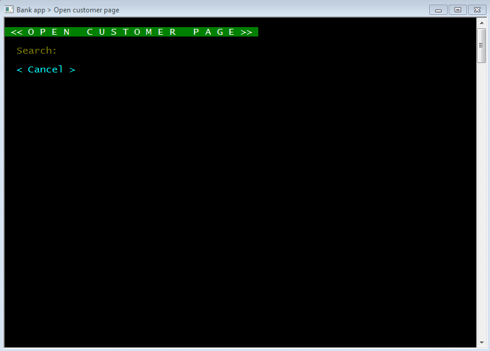
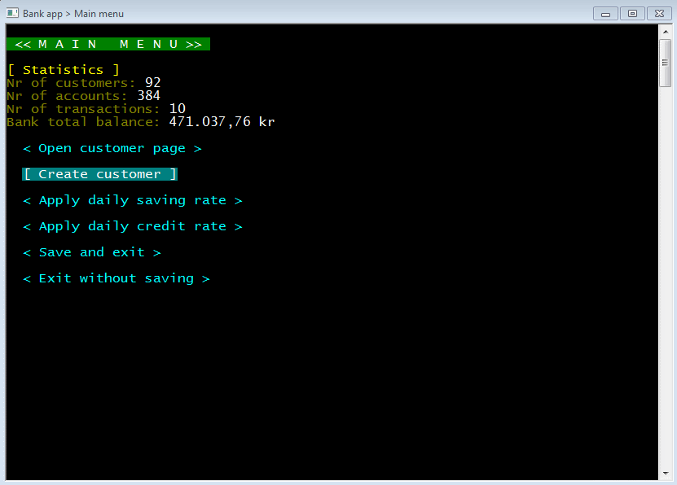
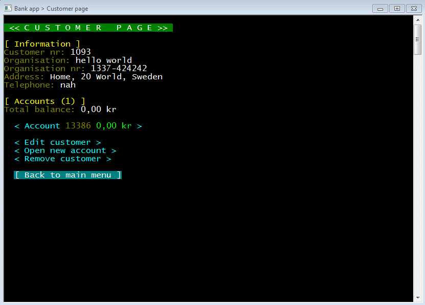
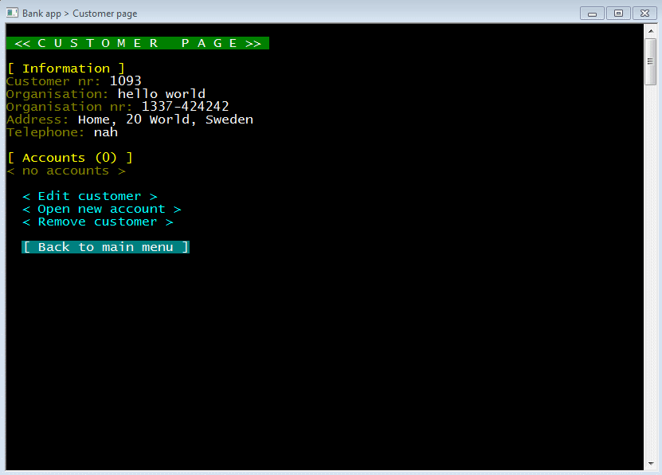
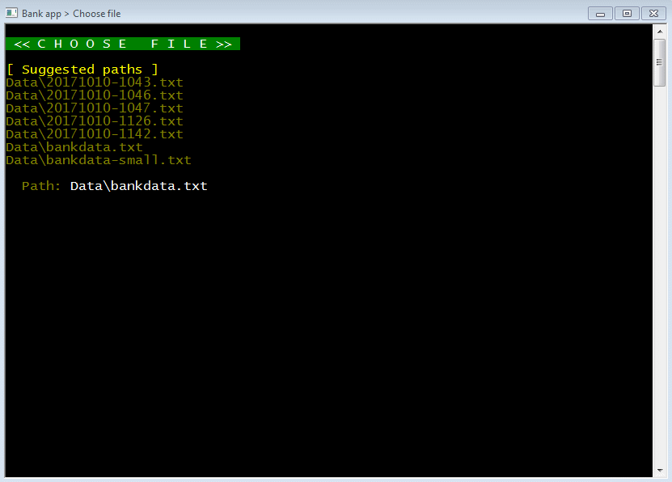

# **Uppgift 03** - *Programmering C#, Nackademin*

## Assignment
> *"Create a bank console application that can search customers and accounts, create customers, accounts, and transactions, but also handle credit and saving/loading from a savefile."*

---

## Search customers

## Create customer

## Transactions

## Credit

## Load savefiles

